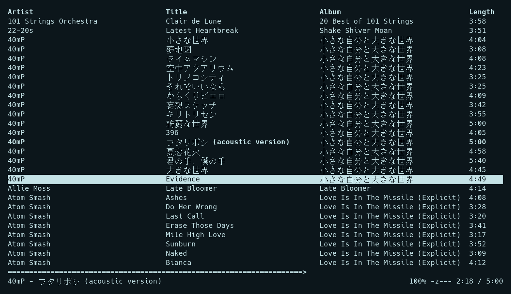

# Pantomime - An NCURSES MPD client

Pantomime is a simple ncurses-based MPD client.

To view source code, issues, and merge requests, please visit the [main project page](https://git.julianneadams.info/LeftySolara/pantomime).

There is also a repository mirror [available on GitHub](https://github.com/LeftySolara/pantomime).

